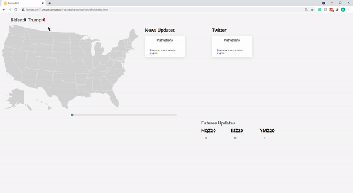

# Future-Poll-Dashboard
This repo showcases the future poll dashboard my team and I developed during my senior year of college (2020). The dashboard was built using HTML/CSS, React js, and mutliple APIs. The purpose of this project was to develop a one-stop-shop where investors and others with similar interests can view multiple sources of information about events during the unpredictable times of Covid and the 2020 presidential election.

## Functions
 * Displays dynamic United States map that reacts to scroll bar. Displays which party each state voted for and the total votes for each candidate and any given time.
 * Displays multiple news articles, twitter posts, and stock data that change together via the scroll bar

## Demo

## Building it
 1. Open a shell
 2. > npm install
 3. > npm start
 4. Done!
